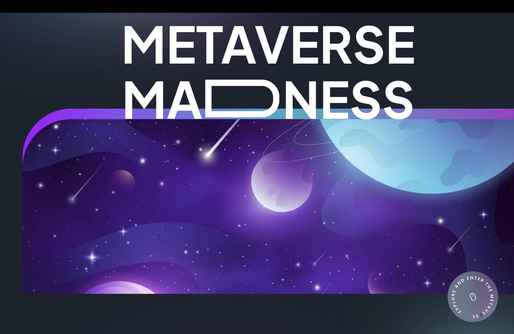

### Metaverse Landing Page

Welcome to the Metaverse landing page, where you can explore the future of virtual reality and experience a world where your dreams become reality. The Metaverse offers a unique and immersive experience, allowing users to feel like they're truly part of a virtual world. With only VR devices, you can easily explore the Metaverse and turn your dreams into reality.

---

#### About

The Metaverse landing page is developed and maintained by [Md Musfikur Rahman](https://musfikur.com). We are passionate about exploring the possibilities of virtual reality and creating immersive experiences for users around the world. Join us on this journey to discover the madness of the Metaverse and unlock new dimensions of reality.

---

#### Technologies Used

- **Next.js**: A React framework for building server-side rendered and statically generated web applications.
- **Framer Motion**: A React library for creating fluid animations and transitions, enhancing the user experience.
- **Tailwind CSS**: A utility-first CSS framework for building responsive and customizable user interfaces with ease.

---

#### Mission Statement

At Metaverse, our mission is to redefine the way people interact with virtual reality and experience immersive environments. We aim to create a platform where users can explore their imagination and turn their dreams into reality. With cutting-edge technology and a passion for innovation, we strive to push the boundaries of what's possible in the virtual world.

---

#### Deployment

The Metaverse landing page is deployed on [deployment platform], ensuring reliable hosting and accessibility. The deployment process is automated and streamlined, allowing for quick updates and optimizations.

**Live Link**: [Metaverse Landing Page Demo](https://meta-verses.vercel.app)

To deploy the Metaverse landing page:

1. Clone the repository from GitHub.
2. Install dependencies using npm or yarn.
3. Configure environment variables as necessary.
4. Connect the project to the deployment platform and deploy using the provided tools or scripts.
5. Monitor the deployment status and access the live application URL.

---

#### Contributing

Contributions to the Metaverse landing page are welcome! Whether you want to suggest new features, report bugs, or submit code improvements, please follow these guidelines:

- Fork the repository and create a new branch for your changes.
- Commit your changes with descriptive messages.
- Open a pull request, explaining the purpose and impact of your changes.
- Participate in discussions and address feedback to ensure the quality of contributions.

---

#### Contact

For inquiries, feedback, or support, please contact the project maintainer(s) at [contact@musfikur.com](mailto:contact@musfikur.com).

---

**Screenshot**:

